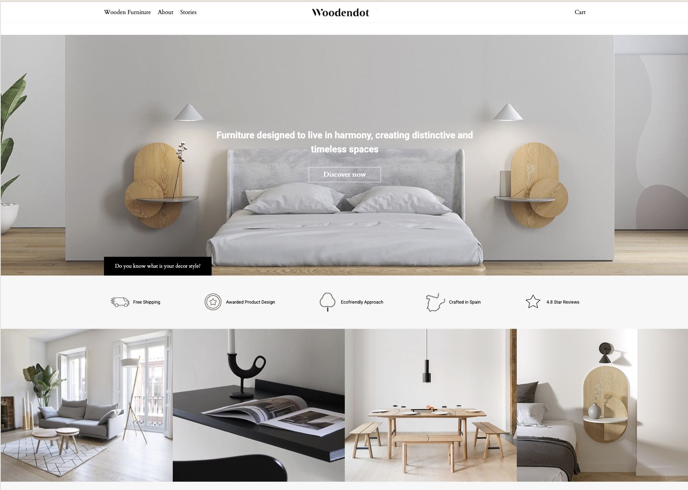
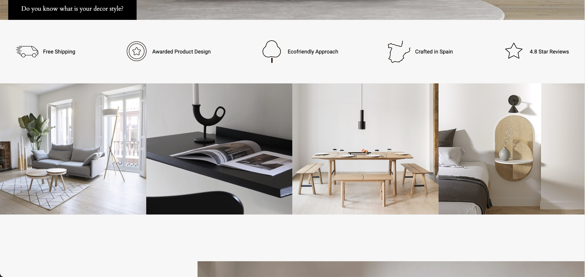

# Woodendot Landing

Responsive landing page built from a Figma design.

## Technologies

* HTML5
* CSS3
* JavaScript
* Flexbox
* CSS Grid
* BEM Methodology

## Features

* Responsive design for desktop, tablet, and mobile devices
* Semantic HTML markup
* Mobile burger menu
* Modern CSS architecture
* Hover animations and interactive elements
* Optimized project structure

## Project Preview

## Live Demo

link

## Repository

https://github.com/KamDiaV/woodendot-landing